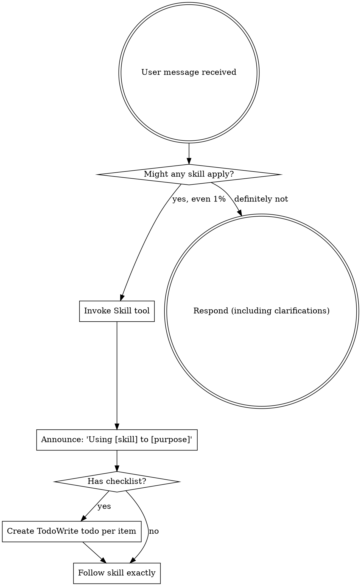

# 实验成功：The Model Context Protocol Book

## 来源
- [The Model Context Protocol Book](https://cloudstreet-dev.github.io/MCP-Model-Context-Protocol/)

## 来源正文摘录（抓取）
```
Introduction - The Model Context Protocol Book Keyboard shortcuts Press ← or → to navigate between chapters Press S or / to search in the book Press ? to show this help Press Esc to hide this help Auto Light Rust Coal Navy Ayu The Model Context Protocol Book The Model Context Protocol Book A comprehensive guide for developers who want to understand, build, and deploy MCP servers and clients. MCP is the open standard that connects AI applications to the tools and data they need. This book takes you from “what is MCP?” to “I’m running MCP servers in production.” Who This Book Is For Backend developers building tools and APIs that AI agents should be able to use AI/ML engineers creating applications that need to interact with external systems Full-stack developers integrating MCP into existing products Technical leads evaluating MCP for their organization Anyone curious about how the sausage gets made when Claude checks the weather No prior MCP knowledge required. Familiarity with JSON, APIs, and at least one programming language (TypeScript or Python preferred) will help. Table of Contents Part I: Understanding MCP Chapter Title What You’ll Learn 01 The Problem MCP Solves Why MCP exists, the N-times-M integration nightmare, and MCP’s “USB-C moment” 02 Architecture Hosts, clients, servers, trust boundaries, capability negotiation, and the three-layer cake 03 The Wire Protocol JSON-RPC 2.0, message types, method catalog, initialization handshake, error codes, pagination, cancellation Part II: The Three Primitives Chapter Title What You’ll Learn 04 Tools Tool definitions, schemas, annotations, discovery, invocation, result types, error handling, best practices 05 Resources URIs, resource templates, subscriptions, binary data, audience annotations, resources vs. tools 06 Prompts Prompt templates, arguments, multi-message prompts, embedded resources, practical patterns Part III: Transport and Communication Chapter Title What You’ll Learn 07 Transports stdio, Streamable HTTP, legacy SSE, the proxy pattern, transport security, debugging transports Part IV: Building Things Chapter Title What You’ll Learn 08 Building Servers in TypeScript McpServer API, Zod schemas, weather server example, HTTP transport, publishing to npm 09 Building Servers in Python FastMCP, decorators, type hints, SQLite explorer example, uvx, publishing to PyPI 10 Building Clients TypeScript and Python clients, building a host, managing multiple servers, the full agentic loop Part V: The Ecosystem Chapter Title What You’ll Learn 11 The SDK Landscape All 10 official SDKs (TypeScript, Python, Go, C#, Java, Kotlin, Swift, Rust, Ruby, PHP), choosing an SDK 12 Configuration Setting up MCP in Claude Desktop, Claude Code, VS Code, Cursor, and Windsurf Part VI: Security and Advanced Topics Chapter Title What You’ll Learn 13 Authentication and Security OAuth 2.1, trust boundaries, threat modeling, security best practices for servers and hosts 14 Advanced Features Sampling, elicitation, roots, completion, logging, progress reporting Part VII: Production and Beyond Chapter Title What You’ll Learn 15 Testing and Debugging MCP Inspector, manual testing, common problems, testing strategies, debugging tips 16 Production Patterns Deployment models, Docker/K8s, serverless, gateways, multi-tenancy, monitoring, scaling 17 The Ecosystem Official servers, community servers, registries, discovery, evaluating and building for the ecosystem 18 The Future of MCP Stateless protocol, server cards, transport evolution, agent convergence, the road ahead How to Read This Book Linear path : Read chapters 1-18 in order for the complete journey from concepts to production. Quick start : Read chapters 1-2 for the concepts, then jump to chapter 8 (TypeScript) or 9 (Python) to start building. Reference : Each chapter is self-contained. Jump to whatever topic you need. Architecture deep-dive : Chapters 2, 3, 7, and 13 cover the protocol in detail. Practical guide : Chapters 8, 9, 10, 12, and 15 are hands-on with code and configuration. About the Protocol The Model Context Protocol was created by Anthropic and released as an open standard in November 2024. The specification is maintained at modelcontextprotocol.io and the source code is at github.com/modelcontextprotocol . The current specification revision at time of writing is 2025-11-25 . Contributing Found an error? Have a suggestion? Open an issue or pull request. License This book is available under the license specified in the LICENSE file.
```


## 实验分支
`exp/evolution-2026-03-31_00-33-the-model-context-protocol-book-cc9a65da`

## 测试命令
`npm run test:unit`

## Agent 钩子

命令："bash scripts/evolution-agent-multi.sh"

```
实现了一个真实的 MCP HTTP 兼容性改进：`packages/core` 现在能正确处理 Streamable HTTP 返回的 `text/event-stream` 响应，而不再只接受纯 JSON。这让 `mcpListTools` 和 `mcpCallTool` 可以和返回 SSE 帧的 MCP 服务器正常工作，同时也把无效响应体和 JSON-RPC 错误的报错信息做得更清楚了。核心改动在 [mcp-jsonrpc.ts](/Users/penglei/developer/self-test-grounding/ppeng-agent-core/.evolution-worktrees/2026-03-31_00-33-the-model-context-protocol-book-cc9a65da/packages/core/src/mcp-jsonrpc.ts#L7)。

我补了对应单测，覆盖了 `tools/call` 的 SSE 响应、`tools/list` 的多行 `data:` SSE 负载，以及非 JSON 响应的错误信息，见 [mcp-jsonrpc.test.js](/Users/penglei/developer/self-test-grounding/ppeng-agent-core/.evolution-worktrees/2026-03-31_00-33-the-model-context-protocol-book-cc9a65da/packages/core/test/mcp-jsonrpc.test.js#L86)。

验证方面，我先编译了 `packages/core` 和 `packages/capability-gateway` 生成 `dist/`，然后运行了 `npm run test:unit`，结果通过。
evolution-agent-multi: rotate 选中 codex (hash=2125510502, idx=2/4)
evolution-agent-multi: 使用 codex (strategy=rotate)
2026-03-31T00:48:23.038776Z ERROR codex_core_skills::loader: failed to stat skills entry /Users/penglei/.codex/skills/brainstorming (symlink): No such file or directory (os error 2)
2026-03-31T00:48:23.038838Z ERROR codex_core_skills::loader: failed to stat skills entry /Users/penglei/.codex/skills/ai-daily-digest (symlink): No such file or directory (os error 2)
2026-03-31T00:48:23.038842Z ERROR codex_core_skills::loader: failed to stat skills entry /Users/penglei/.codex/skills/vercel-react-best-practices (symlink): No such file or directory (os error 2)
2026-03-31T00:48:23.045868Z ERROR codex_core_skills::loader: failed to stat skills entry /Users/penglei/.agents/skills/ui-ux-pro-max/scripts (symlink): No such file or directory (os error 2)
2026-03-31T00:48:23.045924Z ERROR codex_core_skills::loader: failed to stat skills entry /Users/penglei/.agents/skills/ui-ux-pro-max/data (symlink): No such file or directory (os error 2)
OpenAI Codex v0.117.0 (research preview)
--------
workdir: /Users/penglei/developer/self-test-grounding/ppeng-agent-core/.evolution-worktrees/2026-03-31_00-33-the-model-context-protocol-book-cc9a65da
model: gpt-5.4
provider: openai
approval: never
sandbox: workspace-write [workdir, /tmp, $TMPDIR, /Users/penglei/.codex/memories]
reasoning effort: high
reasoning summaries: none
session id: 019d415c-f00d-7d73-8e75-14dac7d387a9
--------
user
You are working inside a git worktree of a TypeScript/Node.js project at: /Users/penglei/developer/self-test-grounding/ppeng-agent-core/.evolution-worktrees/2026-03-31_00-33-the-model-context-protocol-book-cc9a65da

Your task: read the source excerpt below and implement a REAL, MEANINGFUL improvement to the repository
based on what you learn from the excerpt. This must be a functional code change — new capability,
improved behavior, better error handling, or a fixed edge case — in source files under packages/ or apps/.

Rules:
- You MUST modify at least one non-test source file under packages/ or apps/ (e.g. a .ts or .mjs file
  that is NOT *.test.* and NOT inside a test/ or __tests__/ directory).
- You MAY add tests as a companion to the feature change, but tests alone are NOT sufficient.
- Do NOT add unrelated features, do NOT change build configs, do NOT modify .env or secrets.
- The change must be small enough to be safe: prefer adding a useful helper, improving an existing
  function's robustness, or implementing a clearly useful missing feature suggested by the excerpt.
- After making changes, run: npm run test:unit to verify they pass.
- Do NOT commit — the pipeline will commit for you.

If you cannot find a meaningful, safe feature improvement inspired by the excerpt, output a single line:
SKIP: <reason>
and exit 0 without modifying any files.

## Project Constraints


## Source Excerpt (inspiration)
Introduction - The Model Context Protocol Book Keyboard shortcuts Press ← or → to navigate between chapters Press S or / to search in the book Press ? to show this help Press Esc to hide this help Auto Light Rust Coal Navy Ayu The Model Context Protocol Book The Model Context Protocol Book A comprehensive guide for developers who want to understand, build, and deploy MCP servers and clients. MCP is the open standard that connects AI applications to the tools and data they need. This book takes you from “what is MCP?” to “I’m running MCP servers in production.” Who This Book Is For Backend developers building tools and APIs that AI agents should be able to use AI/ML engineers creating applications that need to interact with external systems Full-stack developers integrating MCP into existing products Technical leads evaluating MCP for their organization Anyone curious about how the sausage gets made when Claude checks the weather No prior MCP knowledge required. Familiarity with JSON, APIs, and at least one programming language (TypeScript or Python preferred) will help. Table of Contents Part I: Understanding MCP Chapter Title What You’ll Learn 01 The Problem MCP Solves Why MCP exists, the N-times-M integration nightmare, and MCP’s “USB-C moment” 02 Architecture Hosts, clients, servers, trust boundaries, capability negotiation, and the three-layer cake 03 The Wire Protocol JSON-RPC 2.0, message types, method catalog, initialization handshake, error codes, pagination, cancellation Part II: The Three Primitives Chapter Title What You’ll Learn 04 Tools Tool definitions, schemas, annotations, discovery, invocation, result types, error handling, best practices 05 Resources URIs, resource templates, subscriptions, binary data, audience annotations, resources vs. tools 06 Prompts Prompt templates, arguments, multi-message prompts, embedded resources, practical patterns Part III: Transport and Communication Chapter Title What You’ll Learn 07 Transports stdio, Streamable HTTP, legacy SSE, the proxy pattern, transport security, debugging transports Part IV: Building Things Chapter Title What You’ll Learn 08 Building Servers in TypeScript McpServer API, Zod schemas, weather server example, HTTP transport, publishing to npm 09 Building Servers in Python FastMCP, decorators, type hints, SQLite explorer example, uvx, publishing to PyPI 10 Building Clients TypeScript and Python clients, building a host, managing multiple servers, the full agentic loop Part V: The Ecosystem Chapter Title What You’ll Learn 11 The SDK Landscape All 10 official SDKs (TypeScript, Python, Go, C#, Java, Kotlin, Swift, Rust, Ruby, PHP), choosing an SDK 12 Configuration Setting up MCP in Claude Desktop, Claude Code, VS Code, Cursor, and Windsurf Part VI: Security and Advanced Topics Chapter Title What You’ll Learn 13 Authentication and Security OAuth 2.1, trust boundaries, threat modeling, security best practices for servers and hosts 14 Advanced Features Sampling, elicitation, roots, completion, logging, progress reporting Part VII: Production and Beyond Chapter Title What You’ll Learn 15 Testing and Debugging MCP Inspector, manual testing, common problems, testing strategies, debugging tips 16 Production Patterns Deployment models, Docker/K8s, serverless, gateways, multi-tenancy, monitoring, scaling 17 The Ecosystem Official servers, community servers, registries, discovery, evaluating and building for the ecosystem 18 The Future of MCP Stateless protocol, server cards, transport evolution, agent convergence, the road ahead How to Read This Book Linear path : Read chapters 1-18 in order for the complete journey from concepts to production. Quick start : Read chapters 1-2 for the concepts, then jump to chapter 8 (TypeScript) or 9 (Python) to start building. Reference : Each chapter is self-contained. Jump to whatever topic you need. Architecture deep-dive : Chapters 2, 3, 7, and 13 cover the protocol in detail. Practical guide : Chapters 8, 9, 10, 12, and 15 are hands-on with code and configuration. About the Protocol The Model Context Protocol was created by Anthropic and released as an open standard in November 2024. The specification is maintained at modelcontextprotocol.io and the source code is at github.com/modelcontextprotocol
```

## worktree 变更（git diff --stat / status）

```
packages/core/src/mcp-jsonrpc.ts       | 132 +++++++++++++++++++++++++++++++--
 packages/core/test/mcp-jsonrpc.test.js |  82 +++++++++++++++++++-
 2 files changed, 205 insertions(+), 9 deletions(-)

M packages/core/src/mcp-jsonrpc.ts
 M packages/core/test/mcp-jsonrpc.test.js
?? .evolution/
```

## 变更分类
- 功能源码文件：**1 个**
  - `packages/core/src/mcp-jsonrpc.ts`
- 其他文件（测试/文档等）：**1 个**

## 输出摘要

```

added 53 packages in 4s

10 packages are looking for funding
  run `npm fund` for details
实现了一个真实的 MCP HTTP 兼容性改进：`packages/core` 现在能正确处理 Streamable HTTP 返回的 `text/event-stream` 响应，而不再只接受纯 JSON。这让 `mcpListTools` 和 `mcpCallTool` 可以和返回 SSE 帧的 MCP 服务器正常工作，同时也把无效响应体和 JSON-RPC 错误的报错信息做得更清楚了。核心改动在 [mcp-jsonrpc.ts](/Users/penglei/developer/self-test-grounding/ppeng-agent-core/.evolution-worktrees/2026-03-31_00-33-the-model-context-protocol-book-cc9a65da/packages/core/src/mcp-jsonrpc.ts#L7)。

我补了对应单测，覆盖了 `tools/call` 的 SSE 响应、`tools/list` 的多行 `data:` SSE 负载，以及非 JSON 响应的错误信息，见 [mcp-jsonrpc.test.js](/Users/penglei/developer/self-test-grounding/ppeng-agent-core/.evolution-worktrees/2026-03-31_00-33-the-model-context-protocol-book-cc9a65da/packages/core/test/mcp-jsonrpc.test.js#L86)。

验证方面，我先编译了 `packages/core` 和 `packages/capability-gateway` 生成 `dist/`，然后运行了 `npm run test:unit`，结果通过。
evolution-agent-multi: rotate 选中 codex (hash=2125510502, idx=2/4)
evolution-agent-multi: 使用 codex (strategy=rotate)
2026-03-31T00:48:23.038776Z ERROR codex_core_skills::loader: failed to stat skills entry /Users/penglei/.codex/skills/brainstorming (symlink): No such file or directory (os error 2)
2026-03-31T00:48:23.038838Z ERROR codex_core_skills::loader: failed to stat skills entry /Users/penglei/.codex/skills/ai-daily-digest (symlink): No such file or directory (os error 2)
2026-03-31T00:48:23.038842Z ERROR codex_core_skills::loader: failed to stat skills entry /Users/penglei/.codex/skills/vercel-react-best-practices (symlink): No such file or directory (os error 2)
2026-03-31T00:48:23.045868Z ERROR codex_core_skills::loader: failed to stat skills entry /Users/penglei/.agents/skills/ui-ux-pro-max/scripts (symlink): No such file or directory (os error 2)
2026-03-31T00:48:23.045924Z ERROR codex_core_skills::loader: failed to stat skills entry /Users/penglei/.agents/skills/ui-ux-pro-max/data (symlink): No such file or directory (os error 2)
OpenAI Codex v0.117.0 (research preview)
--------
workdir: /Users/penglei/developer/self-test-grounding/ppeng-agent-core/.evolution-worktrees/2026-03-31_00-33-the-model-context-protocol-book-cc9a65da
model: gpt-5.4
provider: openai
approval: never
sandbox: workspace-write [workdir, /tmp, $TMPDIR, /Users/penglei/.codex/memories]
reasoning effort: high
reasoning summaries: none
session id: 019d415c-f00d-7d73-8e75-14dac7d387a9
--------
user
You are working inside a git worktree of a TypeScript/Node.js project at: /Users/penglei/developer/self-test-grounding/ppeng-agent-core/.evolution-worktrees/2026-03-31_00-33-the-model-context-protocol-book-cc9a65da

Your task: read the source excerpt below and implement a REAL, MEANINGFUL improvement to the repository
based on what you learn from the excerpt. This must be a functional code change — new capability,
improved behavior, better error handling, or a fixed edge case — in source files under packages/ or apps/.

Rules:
- You MUST modify at least one non-test source file under packages/ or apps/ (e.g. a .ts or .mjs file
  that is NOT *.test.* and NOT inside a test/ or __tests__/ directory).
- You MAY add tests as a companion to the feature change, but tests alone are NOT sufficient.
- Do NOT add unrelated features, do NOT change build configs, do NOT modify .env or secrets.
- The change must be small enough to be safe: prefer adding a useful helper, improving an existing
  function's robustness, or implementing a clearly useful missing feature suggested by the excerpt.
- After making changes, run: npm run test:unit to verify they pass.
- Do NOT commit — the pipeline will commit for you.

If you cannot find a meaningful, safe feature improvement inspired by the excerpt, output a single line:
SKIP: <reason>
and exit 0 without modifying any files.

## Project Constraints


## Source Excerpt (inspiration)
Introduction - The Model Context Protocol Book Keyboard shortcuts Press ← or → to navigate between chapters Press S or / to search in the book Press ? to show this help Press Esc to hide this help Auto Light Rust Coal Navy Ayu The Model Context Protocol Book The Model Context Protocol Book A comprehensive guide for developers who want to understand, build, and deploy MCP servers and clients. MCP is the open standard that connects AI applications to the tools and data they need. This book takes you from “what is MCP?” to “I’m running MCP servers in production.” Who This Book Is For Backend developers building tools and APIs that AI agents should be able to use AI/ML engineers creating applications that need to interact with external systems Full-stack developers integrating MCP into existing products Technical leads evaluating MCP for their organization Anyone curious about how the sausage gets made when Claude checks the weather No prior MCP knowledge required. Familiarity with JSON, APIs, and at least one programming language (TypeScript or Python preferred) will help. Table of Contents Part I: Understanding MCP Chapter Title What You’ll Learn 01 The Problem MCP Solves Why MCP exists, the N-times-M integration nightmare, and MCP’s “USB-C moment” 02 Architecture Hosts, clients, servers, trust boundaries, capability negotiation, and the three-layer cake 03 The Wire Protocol JSON-RPC 2.0, message types, method catalog, initialization handshake, error codes, pagination, cancellation Part II: The Three Primitives Chapter Title What You’ll Learn 04 Tools Tool definitions, schemas, annotations, discovery, invocation, result types, error handling, best practices 05 Resources URIs, resource templates, subscriptions, binary data, audience annotations, resources vs. tools 06 Prompts Prompt templates, arguments, multi-message prompts, embedded resources, practical patterns Part III: Transport and Communication Chapter Title What You’ll Learn 07 Transports stdio, Streamable HTTP, legacy SSE, the proxy pattern, transport security, debugging transports Part IV: Building Things Chapter Title What You’ll Learn 08 Building Servers in TypeScript McpServer API, Zod schemas, weather server example, HTTP transport, publishing to npm 09 Building Servers in Python FastMCP, decorators, type hints, SQLite explorer example, uvx, publishing to PyPI 10 Building Clients TypeScript and Python clients, building a host, managing multiple servers, the full agentic loop Part V: The Ecosystem Chapter Title What You’ll Learn 11 The SDK Landscape All 10 official SDKs (TypeScript, Python, Go, C#, Java, Kotlin, Swift, Rust, Ruby, PHP), choosing an SDK 12 Configuration Setting up MCP in Claude Desktop, Claude Code, VS Code, Cursor, and Windsurf Part VI: Security and Advanced Topics Chapter Title What You’ll Learn 13 Authentication and Security OAuth 2.1, trust boundaries, threat modeling, security best practices for servers and hosts 14 Advanced Features Sampling, elicitation, roots, completion, logging, progress reporting Part VII: Production and Beyond Chapter Title What You’ll Learn 15 Testing and Debugging MCP Inspector, manual testing, common problems, testing strategies, debugging tips 16 Production Patterns Deployment models, Docker/K8s, serverless, gateways, multi-tenancy, monitoring, scaling 17 The Ecosystem Official servers, community servers, registries, discovery, evaluating and building for the ecosystem 18 The Future of MCP Stateless protocol, server cards, transport evolution, agent convergence, the road ahead How to Read This Book Linear path : Read chapters 1-18 in order for the complete journey from concepts to production. Quick start : Read chapters 1-2 for the concepts, then jump to chapter 8 (TypeScript) or 9 (Python) to start building. Reference : Each chapter is self-contained. Jump to whatever topic you need. Architecture deep-dive : Chapters 2, 3, 7, and 13 cover the protocol in detail. Practical guide : Chapters 8, 9, 10, 12, and 15 are hands-on with code and configuration. About the Protocol The Model Context Protocol was created by Anthropic and released as an open standard in November 2024. The specification is maintained at modelcontextprotocol.io and the source code is at github.com/modelcontextprotocol . The current specification revision at time of writing is 2025-11-25 . Contributing Found an error? Have a suggestion? Open an issue or pull request. License This book is available under the license specified in the LICENSE file.
ERROR: Reconnecting... 2/5
ERROR: Reconnecting... 3/5
ERROR: Reconnecting... 4/5
ERROR: Reconnecting... 5/5
ERROR: Reconnecting... 1/5
codex
任务是基于摘录在 `packages/` 或 `apps/` 下做一个小而真实的功能改进，并跑 `npm run test:unit` 验证。我先快速读一下仓库里与 MCP 协议、传输或错误处理相关的实现，找一个能安全落地的边界改进点。
exec
/bin/zsh -lc "sed -n '1,220p' /Users/penglei/.agents/skills/using-superpowers/SKILL.md" in /Users/penglei/developer/self-test-grounding/ppeng-agent-core/.evolution-worktrees/2026-03-31_00-33-the-model-context-protocol-book-cc9a65da
 succeeded in 0ms:
---
name: using-superpowers
description: Use when starting any conversation - establishes how to find and use skills, requiring Skill tool invocation before ANY response including clarifying questions
---

<EXTREMELY-IMPORTANT>
If you think there is even a 1% chance a skill might apply to what you are doing, you ABSOLUTELY MUST invoke the skill.

IF A SKILL APPLIES TO YOUR TASK, YOU DO NOT HAVE A CHOICE. YOU MUST USE IT.

This is not negotiable. This is not optional. You cannot rationalize your way out of this.
</EXTREMELY-IMPORTANT>

## How to Access Skills

**In Claude Code:** Use the `Skill` tool. When you invoke a skill, its content is loaded and presented to you—follow it directly. Never use the Read tool on skill files.

**In other environments:** Check your platform's documentation for how skills are loaded.

# Using Skills

## The Rule

**Invoke relevant or requested skills BEFORE any response or action.** Even a 1% chance a skill might apply means that you should invoke the skill to check. If an invoked skill turns out to be wrong for the situation, you don't need to use it.



## Red Flags

These thoughts mean STOP—you're rationalizing:

| Thought | Reality |
|---------|---------|
| "This is just a simple question" | Questions are tasks. Check for skills. |
| "I need more context first" | Skill check comes BEFORE clarifying questions. |
| "Let me explore the codebase first" | Skills tell you HOW to explore. Check first. |
| "I can check git/files quickly" | Files lack conversation context. Check for skills. |
| "Let me gather information first" | Skills tell you HOW to gather information. |
| "This doesn't need a formal skill" | If a skill exists, use it. |
| "I remember this skill" | Skills evolve. Read current version. |
| "This doesn't count as a task" | Action = task. Check for skills. |
| "The skill is overkill" | Simple things become complex. Use it. |
| "I'll just do this one thing first" | Check BEFORE doing anything. |
| "This feels productive" | Undisciplined action wastes time. Skills prevent this. |
| "I know what that means" | Knowing the concept ≠ using the skill. Invoke it. |

## Skill Priority

When multiple skills could 
```

## 合并

未自动合并（EVOLUTION_AUTO_MERGE=0）；请在主仓手动 `git merge exp/evolution-2026-03-31_00-33-the-model-context-protocol-book-cc9a65da`